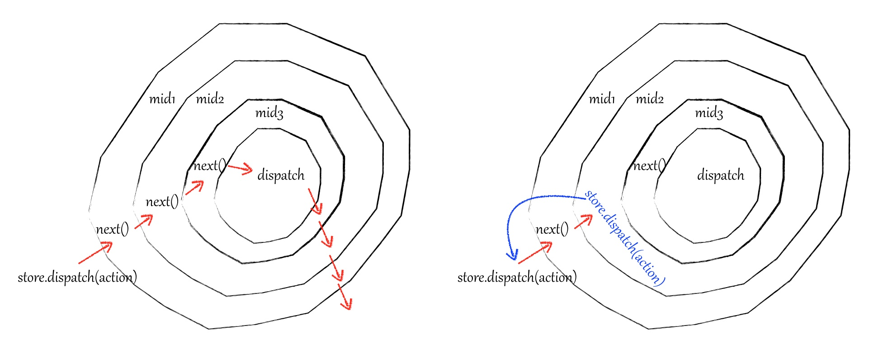

## react-search

## 技术栈
react + redux + react-router + webpack 

## 运行项目
```
// 安装
git clone git@github.com:qzhongyou/react-serarch.git
// 运行
npm start
//访问
[search.zbj.com:3000](search.zbj.com:3000)
```


注: 因为接口数据来至zbj域名,如果需要运行项目,为能正确获取到数据。
**请先绑定host `127.0.0.1	 search.zbj.com`,不然会报错**。
**请先绑定host `127.0.0.1	 search.zbj.com`,不然会报错**。
**请先绑定host `127.0.0.1	 search.zbj.com`,不然会报错**。
重要的话说3遍。

#### 说明
1. 现webpack配置为简陋版,暂时不具参考性。
2. 现服务端为dev类型服务,暂时不具参考性。
3. 对于上面的问题,将在后续开发过程中依次解决。


## React

### React优点 
* 组件化。将一个应用拆分为组件的形式再进行组合,而对于每个组件来说,将应用状态和DOM进行拆分,最终提高了项目的后期**可维护性**。
* 虚拟DOM。这是react的最大卖点之一。虚拟DOM的出现,使得react不需要每次状态改变都去访问DOM。而是生成新的虚拟DOM,和之前的虚拟DOM
进行对比,然后将改变的部分进行渲染。这无疑降低了访问DOM的成本,使其具有**高性能**。(这是真的吗?想知道,看文章最后react的缺点)
* 活跃的react社区。我觉得这点也是相当重要的,活跃的社区,提高了大量的,可靠的第三方库,大大减少了我们开发过程的成本。

### 组件 Props & State
* 子组件和父组件之间可以通过Props进行数据的传递。
* State表示组件的当前状态,通过**改变state进行页面的重新渲染**。
* 兄弟组件之间,通过状态提升,把子组件的state数据提升至其共同的父组件当中保存。之后父组件可以通过props将状态数据传递到子组件当中,**实现通信**。

### 组件生命周期

#### 组件实例化创建
* **getDefaultProps**  
作用于组件类,设置默认的props,只调用一次。es6中使用静态属性static defaultProps表示。
* **getInitialState**  
实例创建时调用一次,设置默认state。es6中可以在constructor中设置this.state表示。
* **componentWillMount**  
组件渲染前调用,这里可以*修改state值*,而*不会*再次触发render。
* **render**  
根据props和state创建虚拟DOM。
* **componentDidMount**   
渲染结束后调用,修改state将被渲染。可以通过findDOMNode去获取修改DOM。服务器端无法使用componentDidMount。

#### 组件更新
* **componentWillReceivePorps(nextProps)**  
属性改变时调用,nextProps为更新后的props,这里容易混淆。
* **shouldComponentUpdate(nextProps, nextState)**  
nextProps,nextState分别为更新后的属性和状态。通常我们在这里判断属性和状态是否改变,是否需要重新渲染。如果返回true将渲染,false不会。
* **componentWillUpdate(nextProps, nextState)**  
组件更新渲染前调用,可以设置state。
* **componentDidUpdate()**  
组件渲染后调用,修改state将被渲染。可以通过findDOMNode去获取修改DOM。
#### 组件卸载
* **componentWillUnmount**  
组件将被卸载时调用,一般用来清除事件监听和定时器。

### React缺点
* 虚拟DOM。这是react的优势也是有很大缺点的。首先,每次小小状态改变都要去生成新的虚拟DOM,如果这个虚拟DOM的结构复杂无疑带来很多开销。其次,比如:
我们需要改变一个子组件的数据,但数据来至于父级。这时候,子组件的兄弟组件都会被重新执行render,生成虚拟DOM。还有,我们在做列表的时候,都必须加上key
来提高性能。react本身并不能很好的处理这些问题,必须我们人为的通过添加key,通过shouldComponentUpdate方法比较,immutable等方法去提升性能。
* 视图层。只使用react本身是不能构建一个合格的应用的,必须结合周边各种库的辅助。
* Facebook前段时间闹出的版权专利事,大家都懂的,这可是程序员没法解决的问题。O__O "…"

## React Router
React Router为React提供了一个路由功能,根据路由规则渲染对应的组件。
### React Router API
#### \<BrowserRouter>
* basename: string  当前位置的基准URL。
* getUserConfirmation:func  导航到此页面前执行的函数,默认使用 window.confirm
* forceRefresh:bool 当浏览器不支持 HTML5 的 history API 时强制刷新页面。
* keyLength: number 设置`location.key`的长度。默认6。(key的作用：点击同一个链接时，每次该路由下的location.key都会改变，可以通过key的变化来刷新页面。)
* children: node 组件
#### \<HashRouter>
* basename: string
* getUserConfirmation: func
* hashType: string window.location.hash 使用的`hash`类型
* children: node
不再一一列举了,React Router更多属性看[文档](http://reacttraining.cn/)

### 按需加载
为了提升页面的性能,减少第一次渲染时js静态资源大小。一般我们会采用按需加载。
* React Router 3
```javascript
const WitkeyContainer = (location, cb) => {
    require.ensure([], require=> {
        cb(null, require("../containers/WitkeyContainer").default) //es6 使用default
    }, 'WitkeyContainer')  //WitkeyContainer 为 chunkName
}


 <Route exact path="/exclusive" component={WitkeyContainer}/>
```

* React Router 4
这个稍微复杂些,需要先引用[bundle.js](https://github.com/qzhongyou/react-search/blob/master/route/bundle.js),然后
```javascript
import Bundle from './bundle.js';

//需要使用bundle-loader
import Witkey from "bundle-loader?lazy!../containers/WitkeyContainer"; 

//props 需要传入不然使用不了 react Router中的location,match等属性
export const WitkeyContainer = (props) => (
    <Bundle load={Witkey}>
        {(Container) => <Container {...props}/>}
    </Bundle>
)

 <Route exact path="/exclusive" component={WitkeyContainer}/>
```
#### react-router & react-router-dom 
react-router提供了核心的组件和方法,react-router-dom则在此基础上提供了Link等DOM组件。

## Redux

### 三大原则 (来自[文档](http://cn.redux.js.org/docs/introduction/ThreePrinciples.html))
* 单一数据源 整个应用的state被储存在一棵object tree中，并且这个object tree只存在于**唯一**一个store中。
* State只读 唯一改变state的方法就是触发**action**，action是一个用于描述已发生事件的普通对象。
* 使用纯函数来执行修改  为了描述action如何改变state tree ，你需要编写reducers。 

### Redux 核心API

#### Store 
* **createStore()**  
Redux核心API都来至于createStore最终创建的Store对象。`createStore(reducer, [preloadedState], enhancer)`接受3个参数,
第一个参数为`reducer`,它应该为一个纯函数,接受state和action2个参数。根据action对state进行处理返回新的state。`preloadedState`
初始状态值,一般来至服务器端。`enhancer`是一个高阶函数,接受createStore作为参数,对createStore进行争强,并返回增强后的createStore。
通常我们会将`applyMiddleware`调用后返回的函数,作为`enhancer`。

```javascript
//createStore.js 源码
export default function createStore(reducer, preloadedState, enhancer) {
    //判断入参类型等操作
    ....... 
    //enhancer为高阶函数,将createStore 作为入参
    return enhancer(createStore)(reducer, preloadedState)
}
```
#### store对象的方法 
* **getState()**    
获取当前状态并返回,整个state树的状态。
* **subscribe(listener)**  
添加一个监听器,每当state树改变时就会触发,通常我们可以在listener中使用getState获取当前的状态。为什么我们没有在react
项目中使用呢?因为在react-redux中的connect方法中已经帮我们做了处理。
* **dispatch(action)**      
触发一个action,唯一的改变state树的方法。如果添加了中间件其实这里的dispatch是`_dispatch = _compose2['default'].apply(undefined, chain)(store.dispatch);`
返回的`_dispatch`。这时触发`dispatch(action)`将一层一层的去调用middleware,和下面的middleware流程图一样。
* **replaceReducer**    
替换当前reducer。

#### 其他方法
* **combineReducers(reducers)**  
combineReducers入参为一个或多个reducer构成**对象**,reducer通常是一个接受state和action为参数,根据action返回新的state的纯函数。
combineReducers是一个高阶函数,`combineReducers(reducers)`其实返回了一个新的reducer入参对象的key值拆分state,传入对应的reducer中,最后返回新的state。源码:
```javascript
 return function combination() {
   ....
   for (var _i = 0; _i < finalReducerKeys.length; _i++) {
   ....
     var reducer = finalReducers[_key];
     var previousStateForKey = state[_key];
     var nextStateForKey = reducer(previousStateForKey, action);
   ....
   }
   ...
   return hasChanged ? nextState : state;
 }
```
* **applyMiddleware(...middlewares)**   
 applyMiddleware通过串联的方式使得能让中间件依次执行,返回一个增强的store。其中,这时的store.dispatch为中间件调用后返回的入参为action的匿名函数。
 middleware为一个高阶函数,结构为`(store)=>(next)=>(action)=>{....}`;
 ```javascript
 // applyMiddleware.js 
 return function (createStore) {
     //结合上面createStore中源码,enhancer这里为空
     return function (reducer, preloadedState, enhancer) {
       //返回store
       var store = createStore(reducer, preloadedState, enhancer);
       var _dispatch = store.dispatch;
       var chain = [];
 
       var middlewareAPI = {
         getState: store.getState,
         dispatch: function dispatch(action) {
           return _dispatch(action);
         }
       };
       chain = middlewares.map(function (middleware) {       //chain为数组
         return middleware(middlewareAPI);   //中间件调用传入store,返回(next=>action=>{...})函数
       });
       //compose为函数串联执行 如:f1(f2(f3(store.dispatch))), 实现了中间件按顺序执行
       _dispatch = _compose2['default'].apply(undefined, chain)(store.dispatch);
       return _extends({}, store, {       //返回增强store
         dispatch: _dispatch
       });
     };
   };
 ```

 middleware流程图,解释调用next与dispatch区别
 
 
 * **bindActionCreators(actionCreators,dispatch)**
 bindActionCreators内部对actionCreators添加dispatch处理,返回一个函数。调用bindActionCreators后,直接调用返回函数,不再调用dispatch。
 
 ### React-Redux
 * **\<Provider>**  
 `<Provider store>`使组件层级中的`connect()`方法都能够获得 Redux store。正常情况下，你的根组件应该嵌套在 <Provider> 中才能使用 connect() 方法。
 * **connect([mapStateToProps], [mapDispatchToProps], [mergeProps], [options])**      
 连接 `React` 组件与 `Redux store`。           
 
**[mapStateToProps(state, [ownProps]): stateProps]**    
当store树改变将会调用该函数。该回调函数必须返回一个纯对象，这个对象会与组件的`props`合并。如果指定了该回调函数中的第二个参数`ownProps`，
则该参数的值为传递到组件的`props`，而且只要组件接收到新的 props，`mapStateToProps`也会被调用。
    
**[mapDispatchToProps(dispatch, [ownProps]): dispatchProps]**        
如果为mapDispatchToProps为一个对象,那么对象内的函数将作为`action creator`,函数名称作为`props`属性名称。对象内的每一个函数将返回一个
`function () { return dispatch(actionCreator.apply(undefined, arguments));}`这样的新函数。如果mapDispatchToProps为函数,
将根据开发者自己将`action creator`和`dispatch`绑定在一起,一般我们使用`bindActionCreators`完成绑定。如果指定了该回调函数中第二个参
数`ownProps`，该参数的值为传递到组件的`props`，而且只要组件接收到`props`，`mapDispatchToProps`也会被调用。            
 
**[mergeProps(stateProps, dispatchProps, ownProps): props]**       
`mapStateToProps()`与`mapDispatchToProps()`的执行结果和组件自身的`props`将传入到这个回调函数中。该回调函数返回的对象将作为`props`
传递到被包装的组件中。


## 推荐项目结构
```
.
├── app/
│   ├── service/                      服务端
│   │   ├── lib/                      lib
│   │   └── routes/                   服务端路由
│   └──── webroot/                    前端web目录
│       ├── actions/                  action
│       ├── components/               展示型组件
│       ├── middlewares/              自定义中间件
│       ├── reducers/                 reducers
│       ├── containers/               容器组件
│       ├── route/                    前端路由
│       └── store/                    store
├── mockers/
├── server.js                         服务
├── index.html                        html
├── package.json
├── README.md
└── .gitignore
```
简单的项目结构,复杂项目结构需要根据自身需要进行修改。

